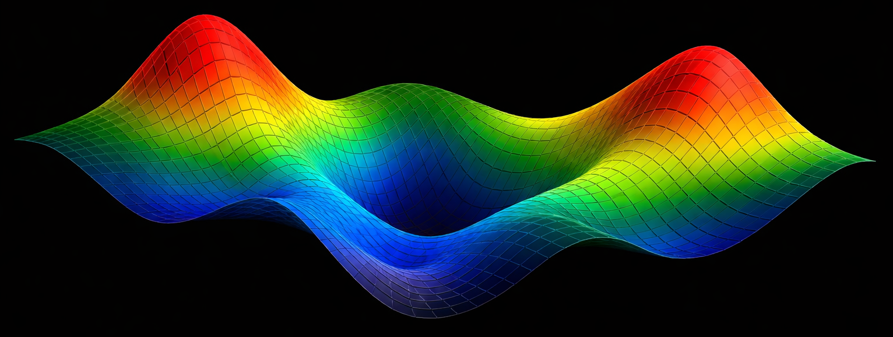

# Machine Learning Models




*Author*: Nicolo Ceneda \
*Contact*: n.ceneda20@imperial.ac.uk \
*Website*: [nicoloceneda.github.io](https://nicoloceneda.github.io/) \
*Institution*: Imperial College London \
*Course*: PhD in Finance

## Description

This repository is a collection of ready-to-run machine learning and deep learning examples. Each script focuses on a specific model or method, including implementations from scratch, scikit-learn, and PyTorch  workflows.

## Installation

Create and activate a virtual environment:

```bash
conda create -n envML python=3.12 -y
conda activate envML
```

Install dependencies from `requirements.txt`:

```bash
pip install --upgrade pip
pip install -r requirements.txt
```

## Index

Expand the dropdown windows for details.

### Foundations


<details>
<summary><code>01_perceptron.py</code></summary>


* Model: perceptron
* Implementation: manual
* Task: binary classification
* Dataset: Iris


</details>

<details>
<summary><code>02_perceptron_sl.py</code></summary>


* Model: perceptron
* Implementation: scikit-learn
* Task: multi-class classification
* Dataset: Iris


</details>

<details>
<summary><code>03_adaline_gd.py</code></summary>


* Model: adaline (gradient descent)
* Implementation: manual
* Task: binary classification
* Dataset: Iris


</details>

<details>
<summary><code>04_adaline_sgd.py</code></summary>


* Model: adaline (stochastic gradient descent)
* Implementation: manual
* Task: binary classification
* Dataset: Iris


</details>

<details>
<summary><code>05_logistic_regression.py</code></summary>


* Model: logistic regression
* Implementation: manual
* Task: binary classification
* Dataset: Iris


</details>

<details>
<summary><code>06_logistic_regression_sl.py</code></summary>


* Model: logistic regression
* Implementation: scikit-learn
* Task: multi-class classification
* Dataset: Iris


</details>

<details>
<summary><code>07_support_vector_linear_sl.py</code></summary>


* Model: support vector machine
* Implementation: scikit-learn
* Task: multi-class classification
* Dataset: Iris


</details>

<details>
<summary><code>08_support_vector_kernel_sl.py</code></summary>


* Model: kernel support vector machine
* Implementation: scikit-learn
* Task: multi-class classification
* Dataset: Iris


</details>

<details>
<summary><code>09_decision_tree_sl.py</code></summary>


* Model: decision tree
* Implementation: scikit-learn
* Task: multi-class classification
* Dataset: Iris


</details>

<details>
<summary><code>10_random_forest_sl.py</code></summary>


* Model: random forest
* Implementation: scikit-learn
* Task: multi-class classification
* Dataset: Iris


</details>

<details>
<summary><code>11_k_nearest_sl.py</code></summary>


* Model: k-nearest neighbors
* Implementation: scikit-learn
* Task: multi-class classification
* Dataset: Iris


</details>

### Dimensionality Reduction


<details>
<summary><code>12_pca.py</code></summary>


* Model: principal components analysis
* Implementation: manual
* Task: dimensionality reduction (unsupervised)
* Dataset: Wine


</details>

<details>
<summary><code>13_pca_sl.py</code></summary>


* Model: principal components analysis
* Implementation: scikit-learn
* Task: multi-class classification
* Dataset: Wine


</details>

<details>
<summary><code>14_lda.py</code></summary>


* Model: linear discriminant analysis
* Implementation: manual
* Task: multi-class classification
* Dataset: Wine


</details>

<details>
<summary><code>15_lda_sl.py</code></summary>


* Model: linear discriminant analysis
* Implementation: scikit-learn
* Task: multi-class classification
* Dataset: Wine


</details>

<details>
<summary><code>16_tsde_sl.py</code></summary>


* Model: t-distributed stochastic neighbor embedding
* Implementation: scikit-learn
* Task: dimensionality reduction (unsupervised)
* Dataset: Digits


</details>

### Pipelines, Validation & Hyperparameter Search


<details>
<summary><code>17_pipeline_sl.py</code></summary>


* Model: pipeline
* Implementation: scikit-learn
* Task: binary (or multi-class) classification
* Dataset: Wdbc


</details>

<details>
<summary><code>18_cross_val_sl.py</code></summary>


* Model: cross-validation (method 1)
* Implementation: scikit-learn
* Task: binary (or multi-class) classification
* Dataset: Wdbc


</details>

<details>
<summary><code>19_cross_val_sl.py</code></summary>


* Model: cross-validation (method 2)
* Implementation: scikit-learn
* Task: binary (or multi-class) classification
* Dataset: Wdbc


</details>

<details>
<summary><code>20_learning_curves_sl.py</code></summary>


* Model: learning curves
* Implementation: scikit-learn
* Task: binary (or multi-class) classification
* Dataset: Wdbc


</details>

<details>
<summary><code>21_validation_curves_sl.py</code></summary>


* Model: validation curves
* Implementation: scikit-learn
* Task: binary (or multi-class) classification
* Dataset: Wdbc


</details>

<details>
<summary><code>22_grid_search_sl.py</code></summary>


* Model: grid search
* Implementation: scikit-learn
* Task: binary (or multi-class) classification
* Dataset: Wdbc


</details>

<details>
<summary><code>23_random_search_sl.py</code></summary>


* Model: random search
* Implementation: scikit-learn
* Task: binary (or multi-class) classification
* Dataset: Wdbc


</details>

<details>
<summary><code>24_halving_random_search_sl.py</code></summary>


* Model: halving random search
* Implementation: scikit-learn
* Task: binary (or multi-class) classification
* Dataset: Wdbc


</details>

<details>
<summary><code>25_nested_cross_val_sl.py</code></summary>


* Model: nested cross-validation
* Implementation: scikit-learn
* Task: binary (or multi-class) classification
* Dataset: Wdbc


</details>

### Ensemble Methods


<details>
<summary><code>26_majority_vote_classifier.py</code></summary>


* Model: majority vote classifier
* Implementation: manual
* Task: binary classification
* Dataset: Iris


</details>

<details>
<summary><code>27_bagging_sl.py</code></summary>


* Model: bagging
* Implementation: scikit-learn
* Task: binary classification
* Dataset: Wine


</details>

<details>
<summary><code>28_ada_boost_sl.py</code></summary>


* Model: adaboost
* Implementation: scikit-learn
* Task: binary classification
* Dataset: Wine


</details>

<details>
<summary><code>29_xgboost_sl.py</code></summary>


* Model: xgboost
* Implementation: xgboost
* Task: binary classification
* Dataset: Wine


</details>

### NLP & Topic Modeling


<details>
<summary><code>30_sentiment_analysis.py</code></summary>


* Application: sentiment analysis
* Dataset: Imdb


</details>

<details>
<summary><code>31_sentiment_analysis_oocl.py</code></summary>


* Application: sentiment analysis (out-of-core learning)
* Dataset: Imdb


</details>

<details>
<summary><code>32_latent_dirichlet_alloc_sl.py</code></summary>


* Model: Latent dirichlet allocation
* Implementation: scikit-learn
* Task: topic modeling (unsupervised)
* Dataset: Imdb


</details>

### Regression Models


<details>
<summary><code>33_linear_regression_uni_gd.py</code></summary>


* Model: linear regression (gradient descent)
* Implementation: manual
* Task: univariate regression
* Dataset: Housing


</details>

<details>
<summary><code>34_linear_regression_uni_sl.py</code></summary>


* Model: linear regression
* Implementation: scikit-learn
* Task: univariate regression
* Dataset: Housing


</details>

<details>
<summary><code>35_ransac_regression_uni_sl.py</code></summary>


* Model: ransac regression
* Implementation: scikit-learn
* Task: univariate regression
* Dataset: Housing


</details>

<details>
<summary><code>36_linear_regression_mul_sl.py</code></summary>


* Model: linear regression
* Implementation: scikit-learn
* Task: multivariate regression
* Dataset: Housing


</details>

<details>
<summary><code>37_poly_regression_uni_sl.py</code></summary>


* Model: polynomial regression
* Implementation: scikit-learn
* Task: univariate regression
* Dataset: Housing


</details>

<details>
<summary><code>38_decision_tree_regression_sl.py</code></summary>


* Model: decision tree regression
* Implementation: scikit-learn
* Task: univariate regression
* Dataset: Housing


</details>

<details>
<summary><code>39_random_forest_regression_sl.py</code></summary>


* Model: random forest regression
* Implementation: scikit-learn
* Task: univariate regression
* Dataset: Housing


</details>

### Clustering


<details>
<summary><code>40_k_means_clustering_sl.py</code></summary>


* Model: k-means clustering with k-means++ initialization
* Implementation: scikit-learn
* Task: clustering
* Dataset: Synthetic


</details>

<details>
<summary><code>41_hierarchical_clustering.py</code></summary>


* Model: complete linkage agglomerative hierarchical clustering
* Implementation: manual
* Task: clustering
* Dataset: Synthetic


</details>

<details>
<summary><code>42_hierarchical_clustering_sl.py</code></summary>


* Model: complete linkage agglomerative hierarchical clustering
* Implementation: scikit-learn
* Task: clustering
* Dataset: Synthetic


</details>

<details>
<summary><code>43_density_clustering_sl.py</code></summary>


* Model: dbscan clustering
* Implementation: scikit-learn
* Task: clustering
* Dataset: Synthetic


</details>

### Neural Networks


<details>
<summary><code>44_multilayer_perceptron.py</code></summary>


* Model: multilayer perceptron
* Implementation: manual
* Task: multi-class classification
* Dataset: Mnist


</details>

<details>
<summary><code>45_pytorch_basics.py</code></summary>


* Learning: PyTorch basics
* Dataset: Cats and Dogs; CelebA; Mnist


</details>

<details>
<summary><code>46_pytorch_mechanics.py</code></summary>


* Learning: PyTorch mechanics


</details>

<details>
<summary><code>47_linear_regression_uni_sgd.py</code></summary>


* Model: linear regression (stochastic gradient descent)
* Implementation: manual/pytorch
* Task: univariate regression
* Dataset: Synthetic


</details>

<details>
<summary><code>48_linear_regression_uni_sgd_pt.py</code></summary>


* Model: linear regression (stochastic gradient descent)
* Implementation: pytorch
* Task: univariate regression
* Dataset: Synthetic


</details>

<details>
<summary><code>49_multilayer_perceptron_pt.py</code></summary>


* Model: multilayer perceptron (nn.Module)
* Implementation: pytorch
* Task: multi-class classification
* Dataset: Iris


</details>

<details>
<summary><code>50_multilayer_perceptron_pt.py</code></summary>


* Model: multilayer perceptron (nn.Sequential)
* Implementation: pytorch
* Task: binary classification
* Dataset: Synthetic


</details>

<details>
<summary><code>51_multilayer_perceptron_pt.py</code></summary>


* Model: multilayer perceptron (nn.Module)
* Implementation: pytorch
* Task: binary classification
* Dataset: Synthetic


</details>

<details>
<summary><code>52_multilayer_perceptron_pt.py</code></summary>


* Model: multilayer perceptron (nn.Module with custom layer)
* Implementation: pytorch
* Task: binary classification
* Dataset: Synthetic


</details>

<details>
<summary><code>53_fuel_efficiency.py</code></summary>


* Application: predicting fuel efficiency
* Dataset: Auto MPG


</details>

<details>
<summary><code>54_handwritten_digits.py</code></summary>


* Application: classifying handwritten digits
* Dataset: Mnist


</details>

**Sources**

* [Machine Learning with PyTorch and Scikit-Learn](https://sebastianraschka.com/books/#machine-learning-with-pytorch-and-scikit-learn), Sebastian Raschka
